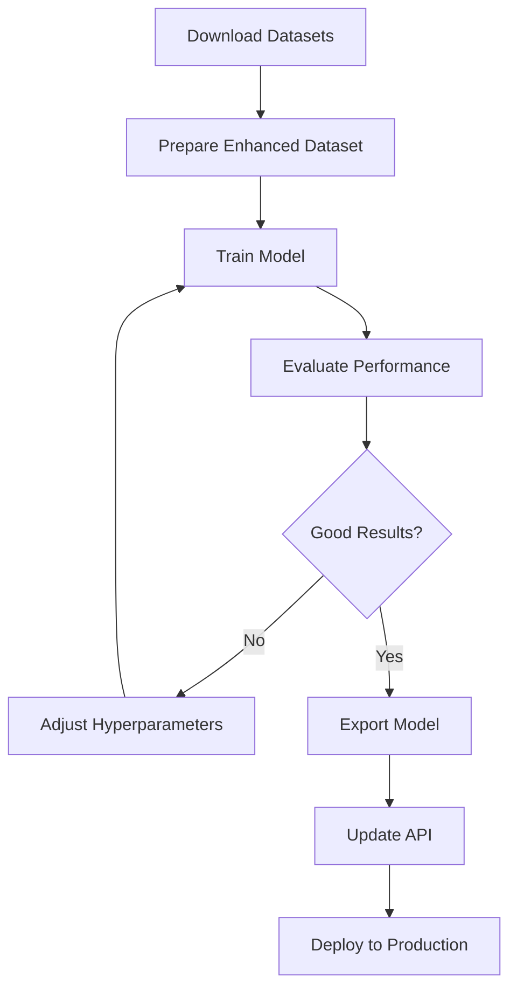

](#3-export-model)
  - [4. Update API](#4-update-api)
- [🎯 Expected Results](#-expected-results)
- [🐛 Troubleshooting](#-troubleshooting)
- [📚 Additional Resources](#-additional-resources)

---

## 🎯 Overview

This training pipeline will help you:
1. Download additional onion datasets from public sources
2. Merge and balance multiple datasets
3. Train YOLOv8 model with optimal hyperparameters
4. Evaluate and export trained model
5. Deploy to production

**Current Dataset:** 1,320 images (Roboflow)  
**Target Dataset:** 5,500+ images (Enhanced)  
**Expected mAP Improvement:** +10-15%

---

## 📦 Installation

### Required Libraries
```bash
# Core (already installed)
pip install ultralytics opencv-python numpy

# Dataset tools
pip install roboflow python-dotenv pyyaml

# Optional: Augmentation
pip install albumentations

# Optional: GPU (CUDA)
pip install torch torchvision --index-url https://download.pytorch.org/whl/cu118
```

### Verify Installation
```bash
python -c "from ultralytics import YOLO; print('✓ Ultralytics OK')"
python -c "import torch; print(f'✓ PyTorch {torch.__version__}')"
python -c "import torch; print(f'✓ CUDA: {torch.cuda.is_available()}')"
```

---

## 🚀 Quick Start (3 Steps)

### Step 1: Download Datasets (30 mins)
```bash
python download_additional_datasets.py
```

**What it does:**
- Downloads your existing Roboflow dataset
- Shows how to find more datasets on Roboflow Universe
- Provides links to Kaggle and Google Images

**Manual alternative:**
1. Visit https://universe.roboflow.com/
2. Search "onion quality" or "vegetable defects"
3. Download datasets in YOLOv8 format
4. Extract to `datasets/` folder

---

### Step 2: Prepare Dataset (15 mins)
```bash
python prepare_enhanced_dataset.py
```

**What it does:**
- Merges all downloaded datasets
- Balances class distribution
- Splits into train/val/test (70/20/10)
- Creates `data.yaml` configuration

**Output:**
```
datasets/enhanced_combined/
├── train/
│   ├── images/ (3,850 images)
│   └── labels/ (3,850 labels)
├── val/
│   ├── images/ (1,100 images)
│   └── labels/ (1,100 labels)
├── test/
│   ├── images/ (550 images)
│   └── labels/ (550 labels)
└── data.yaml
```

---

### Step 3: Train Model (4-8 hours GPU / 24-48 hours CPU)
```bash
# Basic training (200 epochs, batch 16)
python train_enhanced_model.py

# Advanced options
python train_enhanced_model.py --epochs 300 --batch 32 --device 0 --name my_model

# Resume training
python train_enhanced_model.py --resume
```

**Training progress:**
```
Epoch   GPU_mem   box_loss   cls_loss   Instances   mAP@0.5
  1/200    2.5G      1.234      0.876        156      0.650
 50/200    2.5G      0.456      0.234        156      0.820
100/200    2.5G      0.234      0.123        156      0.870
200/200    2.5G      0.123      0.089        156      0.895

✓ Training complete! mAP@0.5 = 0.895
```

---

## 📊 Training Options

### Model Sizes
```bash
# Nano (fastest, 3.2M params)
python train_enhanced_model.py --model yolov8n.pt

# Small (balanced, 11.2M params) - RECOMMENDED
python train_enhanced_model.py --model yolov8s.pt

# Medium (accurate, 25.9M params)
python train_enhanced_model.py --model yolov8m.pt

# Large (most accurate, 43.7M params)
python train_enhanced_model.py --model yolov8l.pt
```

### Training Parameters
```bash
# Quick test (20 epochs, small batch)
python train_enhanced_model.py --epochs 20 --batch 8

# Production training (GPU)
python train_enhanced_model.py --epochs 200 --batch 32 --device 0

# CPU training (slower)
python train_enhanced_model.py --epochs 100 --batch 4 --device cpu

# Multi-GPU training
python train_enhanced_model.py --device 0,1,2,3 --batch 64
```

---

## 📈 Monitor Training

### TensorBoard (Real-time)
```bash
# Start TensorBoard
tensorboard --logdir runs/train

# Open browser
http://localhost:6006
```

**Metrics to watch:**
- `train/box_loss` - Should decrease to <0.2
- `train/cls_loss` - Should decrease to <0.1
- `val/mAP50` - Should increase to >0.85
- `val/precision` - Should increase to >0.88
- `val/recall` - Should increase to >0.85

### Training Logs
```
runs/train/onion_enhanced_v1/
├── weights/
│   ├── best.pt        # Best model (highest mAP)
│   └── last.pt        # Last checkpoint
├── results.png        # Training curves
├── confusion_matrix.png
├── PR_curve.png
├── F1_curve.png
└── args.yaml          # Training config
```

---

## 🎯 After Training

### 1. Evaluate Model
```bash
python evaluate_model.py --weights runs/train/onion_enhanced_v1/weights/best.pt
```

**Output:**
```
📊 Overall Metrics:
  mAP@0.5:      0.8950
  mAP@0.5:0.95: 0.7234
  Precision:    0.9123
  Recall:       0.8756
  F1-Score:     0.8936

📈 Per-Class mAP@0.5:
  onion:              0.9456
  staining:           0.8723
  sprouted:           0.8912
  double_split:       0.8678
  black_smut:         0.9234
  spoiled:            0.8945
  unhealthy:          0.8734
  manual_review:      0.8567
```

---

### 2. Test Inference
```bash
# Test on single image
python -c "from ultralytics import YOLO; \
    model = YOLO('runs/train/onion_enhanced_v1/weights/best.pt'); \
    results = model.predict('test_image.jpg', save=True); \
    print('Detection complete!')"
```

**Or create a test script:**
```python
from ultralytics import YOLO

# Load model
model = YOLO('runs/train/onion_enhanced_v1/weights/best.pt')

# Test on image
results = model.predict(
    'test_image.jpg',
    conf=0.4,
    save=True,
    save_txt=True,
    save_conf=True
)

# Print detections
for r in results:
    print(f"Detected {len(r.boxes)} onions")
    for box in r.boxes:
        class_id = int(box.cls)
        confidence = float(box.conf)
        print(f"  Class: {model.names[class_id]}, Conf: {confidence:.2f}")
```

---

### 3. Export Model
```bash
# Export to ONNX (recommended)
python export_model.py --weights runs/train/onion_enhanced_v1/weights/best.pt --format onnx

# Export to TensorRT (fastest on NVIDIA GPU)
python export_model.py --weights best.pt --format engine --device 0

# Export with FP16 quantization
python export_model.py --weights best.pt --format onnx --half
```

**Exported formats:**
- `best.onnx` - Cross-platform (ONNX Runtime)
- `best.engine` - NVIDIA GPU (TensorRT)
- `best.torchscript` - PyTorch mobile
- `best.mlmodel` - iOS/macOS (CoreML)

---

### 4. Update API

**Option A: Replace model file**
```bash
# Backup old model
cp models/best.pt models/best_old.pt

# Copy new model
cp runs/train/onion_enhanced_v1/weights/best.pt models/onion_detector_enhanced.pt
```

**Option B: Update detection code**

Edit `defect_detection.py`:
```python
# Change MODEL_ID or model path
MODEL_PATH = BASE_DIR / "models" / "onion_detector_enhanced.pt"

# Load local model instead of Roboflow
model = YOLO(str(MODEL_PATH))

# Use for inference
results = model.predict(image, conf=0.4)
```

**Test updated API:**
```bash
# Restart Flask service
python defect_api.py

# Test detection
curl -X POST -F "image=@test.jpg" http://localhost:5000/api/detect
```

---

## 🎯 Expected Results

### Before Training (Roboflow Pre-trained)
```
Dataset:      1,320 images
mAP@0.5:      0.75-0.85
Precision:    ~0.80
Recall:       ~0.75
Training:     N/A (pre-trained)
```

### After Training (Enhanced Dataset)
```
Dataset:      5,500+ images
mAP@0.5:      0.85-0.92 ✅ +10-15%
Precision:    0.88-0.93 ✅ +8-13%
Recall:       0.85-0.90 ✅ +10-15%
Training:     4-8 hours (GPU)
```

### Performance Improvements
- ✅ **Better accuracy** from larger dataset
- ✅ **Fewer false positives** from balanced classes
- ✅ **Better generalization** across conditions
- ✅ **Improved defect detection** for rare classes
- ✅ **More stable predictions** from augmentation

---

## 🐛 Troubleshooting

### Issue 1: "No datasets found"
**Solution:**
```bash
# Run dataset download first
python download_additional_datasets.py

# Or download manually from Roboflow Universe
# Then place in datasets/ folder
```

### Issue 2: "CUDA out of memory"
**Solution:**
```bash
# Reduce batch size
python train_enhanced_model.py --batch 8

# Or use smaller model
python train_enhanced_model.py --model yolov8n.pt

# Or use CPU (slower)
python train_enhanced_model.py --device cpu
```

### Issue 3: "Training too slow on CPU"
**Options:**
1. **Reduce epochs:** `--epochs 50`
2. **Smaller batch:** `--batch 4`
3. **Smaller model:** `--model yolov8n.pt`
4. **Use GPU** (10-20x faster)
5. **Use Google Colab** (free GPU)

### Issue 4: "Model not improving"
**Solutions:**
1. Check dataset quality (clean labels)
2. Balance class distribution
3. Increase epochs (`--epochs 300`)
4. Adjust learning rate in script
5. Try different model size

### Issue 5: "Import errors"
**Solution:**
```bash
# Reinstall packages
pip install --upgrade ultralytics opencv-python roboflow

# Verify installation
python -c "from ultralytics import YOLO; print('OK')"
```

---

## 📚 Additional Resources

### Roboflow Universe
- **Search:** https://universe.roboflow.com/search?q=onion
- **Vegetable Quality:** https://universe.roboflow.com/browse/object-detection
- **Your Workspace:** https://app.roboflow.com/veg1-hcqsf-2

### Kaggle Datasets
- **Search:** https://www.kaggle.com/search?q=onion+quality
- **Vegetables:** https://www.kaggle.com/search?q=vegetable+dataset

### YOLOv8 Documentation
- **Training:** https://docs.ultralytics.com/modes/train/
- **Export:** https://docs.ultralytics.com/modes/export/
- **Tips:** https://docs.ultralytics.com/guides/

### Google Colab (Free GPU)
```
1. Upload training scripts to Google Drive
2. Open Colab: https://colab.research.google.com/
3. Select GPU runtime
4. Mount Drive and run training
```

---

## 🎓 Training Workflow Summary



---

## ✅ Checklist

### Pre-Training
- [ ] Install required packages
- [ ] Download additional datasets
- [ ] Prepare enhanced dataset
- [ ] Verify data.yaml
- [ ] Check GPU availability

### During Training
- [ ] Monitor TensorBoard
- [ ] Watch for overfitting
- [ ] Save checkpoints regularly
- [ ] Check GPU utilization

### Post-Training
- [ ] Evaluate on test set
- [ ] Test on real images
- [ ] Compare with baseline
- [ ] Export best model
- [ ] Update production API
- [ ] Document improvements

---

## 🚀 Ready to Train?

**Run these commands:**
```bash
# 1. Download datasets
python download_additional_datasets.py

# 2. Prepare data
python prepare_enhanced_dataset.py

# 3. Train model
python train_enhanced_model.py

# 4. Evaluate
python evaluate_model.py --weights runs/train/onion_enhanced_v1/weights/best.pt

# 5. Export
python export_model.py --weights runs/train/onion_enhanced_v1/weights/best.pt

# 6. Update API
cp runs/train/onion_enhanced_v1/weights/best.pt models/onion_detector_enhanced.pt
```

---

**Questions?** Read:
- `TRAINING_GUIDE.md` - Comprehensive guide
- `ROBOFLOW_MODEL_ARCHITECTURE.md` - Model architecture
- YOLOv8 docs - https://docs.ultralytics.com/

**Good luck with training!** 🚀🧅
